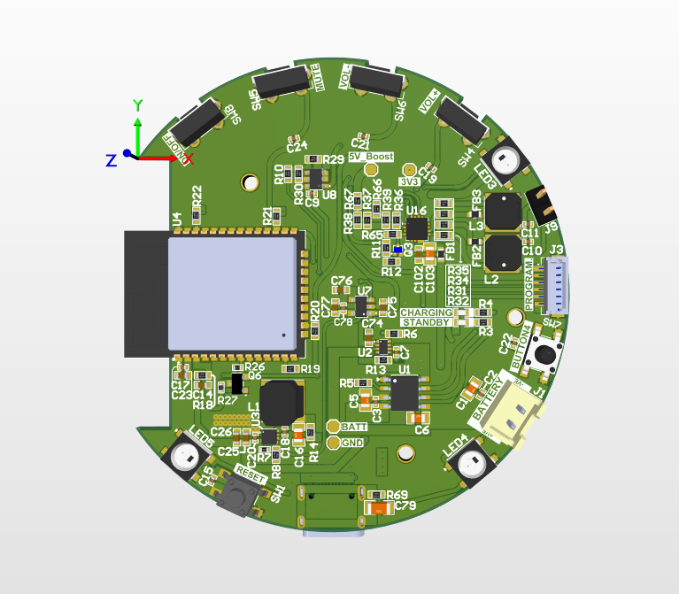
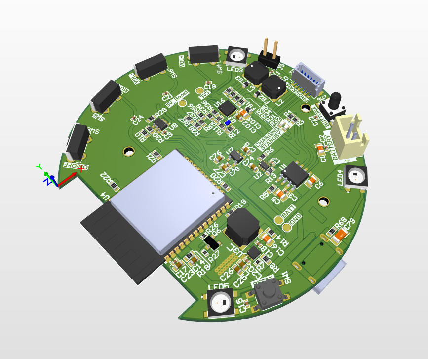

# Smart IoT Audio Streaming System
## Overview

Designed a distributed IoT-based audio streaming system to enable mosques (Masjids) to broadcast Adhan and live audio streams directly to subscribed smart speakers. The system integrates custom ESP32-based hardware devices, MQTT cloud infrastructure, mobile and web applications, and backend services to provide reliable, low-cost, and scalable audio streaming to subscribers.
The solution allows organizations to schedule and trigger audio streams using a smart IoT button and web dashboard, while subscribers receive live audio on portable IoT speakers through secure MQTT event delivery and media streaming.

## Description
The Smart Masjid project delivers an end-to-end IoT audio broadcasting platform consisting of a Smart Speaker, IoT Button, MQTT-based event processing system, backend APIs, and mobile/web applications. The system enables Masjids to broadcast Adhan and announcements in real time to a network of subscribed users.
Organizations register and configure streaming schedules using a web application. Subscribers purchase and configure smart speakers via a mobile app and subscribe to Masjids of their choice. When the Adhan button is pressed at the Masjid, an MQTT event is published to AWS IoT Core, triggering the event processor to determine the correct prayer time and stream URL. Subscribed speakers then begin streaming audio from the media server.
The system supports device provisioning over Wi-Fi, OTA firmware updates, telemetry reporting, and real-time control using secure MQTT messaging.

## Key Features
- ESP32-based Smart IoT Speaker with Wi-Fi connectivity
- One-touch IoT Button to trigger Adhan start/stop events
- Secure MQTT messaging via AWS IoT Core
- Real-time audio streaming from media server
- Mobile app for device provisioning and subscriptions
- Web application for Masjid administration and scheduling
- RGB LED status indication and physical control buttons
- OTA firmware updates
- Device telemetry and health monitoring
- Low-cost hardware design for mass production

## Technologies
- ESP32 microcontroller
- MQTT (AWS IoT Core)
- Embedded C/C++ firmware
- Audio streaming (HTTP / media server)
- Mobile application (Android / iOS)
- Backend APIs (REST)
- Cloud infrastructure (AWS)
- Database for telemetry and user data

## Contribution
- System architecture design (hardware + cloud + software)
- ESP32 firmware design for Smart Speaker and IoT Button
- MQTT topic structure and messaging protocol definition
- Device provisioning via Wi-Fi Access Point mode
- Audio streaming implementation on ESP32
- LED animation and button logic
- Telemetry reporting (battery, connection status)
- OTA firmware update mechanism
- Hardware requirements and cost optimization
- Integration planning for mobile app and backend APIs

## Hardware Requirements
- ESP32 microcontroller
- 3W speaker
- Battery powered
- RGB LED ring
- Power button
- Volume up / down buttons
- Mute button
- Reset button
- Size: 3.5–6 inches
- Logo printing

## Firmware Requirements
- MQTT event consumption
- Audio playback from streaming URL
- Wi-Fi provisioning via Access Point
- New device registration
- OTA firmware updates
- Telemetry reporting (battery, connection, status)
- RGB LED animations

## Cost Target
- Mass production cost ≤ $5 per unit

## PCB

